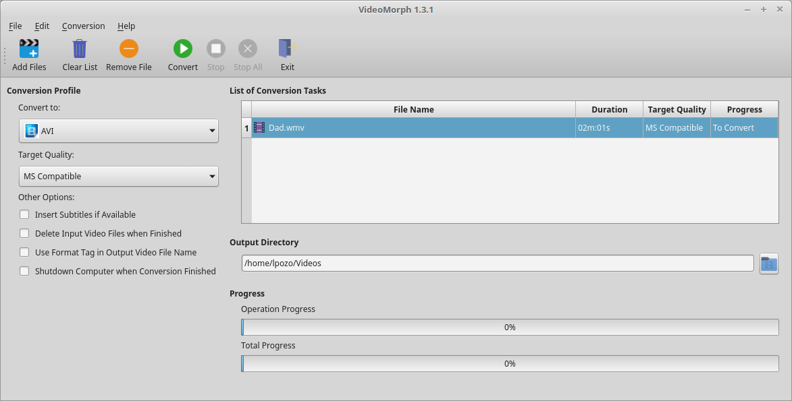

# VideoMorph

VideoMorph is a GUI wrapper for [ffmpeg](http://ffmpeg.org),
based on general ideas from [python-video-converter](https://github.com/senko/python-video-converter)
and presets idea from [QWinFF](http://qwinff.github.io) and
[FF Multi Converter](https://github.com/Ilias95/FF-Multi-Converter).

## Screenshot

## Goal

Unlike other video converters, VideoMorph focuses on a single goal:
make video conversion simple, with an easy to use GUI and allowing
the user to convert to the currently most popular video formats.

VideoMorph GUI is simple and clean, focused on usability, removing annoying options rarely used.
VideoMorph is a video converter, just that. If you want a video editor,
VideoMorph isn't for you.

## Requirements

VideoMorph uses the following libraries and programs:

 - [PyQt5](https://riverbankcomputing.com/software/pyqt/download5)
 - [FFmpeg](http://ffmpeg.org)
 - [Python](https://python.org) > 3.4

You should install these programs and libraries for VideoMorph to work properly.

On Windows systems you also need:

 - [setuptools](https://pypi.python.org/pypi/setuptools)

## Installation

To install the package:

    sudo python3 setup.py install # This does not install dependencies

This only installs VideoMorph. The [ffmpeg](http://ffmpeg.org) package should be installed
or compiled in your distribution. Idem for [PyQt5](https://riverbankcomputing.com/software/pyqt/download5).

On Windows platform, the videomorph.exe file will be placed at path\to\Python3x\Scripts.

On Debian based distros:

    sudo install.sh

This should install VideoMorph and its dependencies, including [ffmpeg](http://ffmpeg.org) library and [PyQt5](https://riverbankcomputing.com/software/pyqt/download5), from
your current repository.

To install from the .deb package on Debian based distros, we recommend you to
use GDebi Packages Installer and follow the instructions, just that... This should install VideoMorph
and its dependencies from your current repository.

To use a Portable Edition (PE), decompress the .tar.gz or the .zip file (GNU/Linux and Windows respectively)
in any directory, and then double click on videomorph or videomorph.exe depending on your platform.

On Windows you may use the installers we provide.

## Contributing

Just clone the repo and make a pull request!

## Licensing and Patents

VideoMorph is licensed under Apache License Version 2.0, more info at [http://www.apache.org/licenses/](http://www.apache.org/licenses/)
Following the idea of [python-video-converter](https://github.com/senko/python-video-converter)
VideoMorph only uses the [ffmpeg](http://ffmpeg.org) binary, so, VideoMorph doesn't need to be licensed
under LGPL/GPL

## Authors and Contributors

Authors:

 - [Ozkar L. Garcell](mailto:ozkar.garcell@gmail.com)
 - [Leodanis Pozo Ramos](mailto:lpozor78@gmail.com)

Contributors:

 - [Maikel Llamaret Heredia](http://gutl.jovenclub.cu)
 - [Carlos Parra Zaldivar](http://libreoffice.cubava.cu)
 - [Leonel Salazar Videaux](http://debianhlg.cubava.cu/)
 - Osmel Cruz

## Copyright

Copyright 2016-2017 VideoMorph Development Team.
